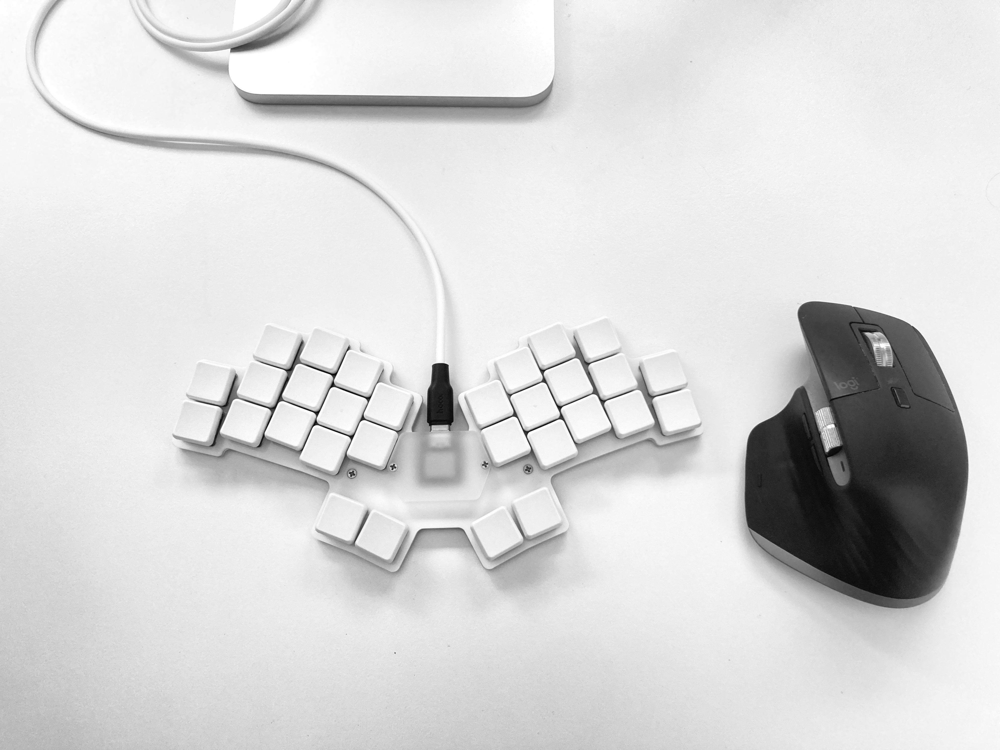
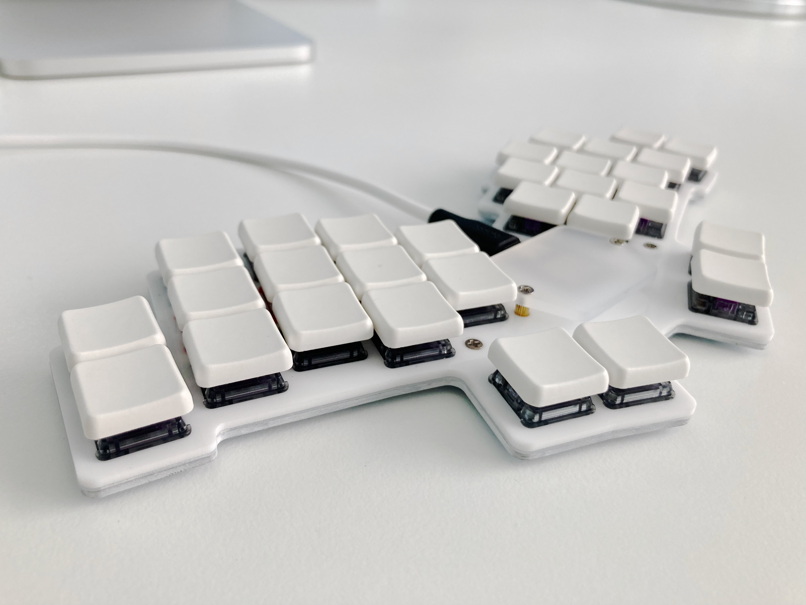

# Tern

Terns are small white seabirds that can hover, but it's also a 30-key keyboard based on the [Hummingbird](https://github.com/PJE66/hummingbird)! Differences from the Hummigbird:

* Hot swappable
* Spaced for Chosfox CFX keycaps (tighter than normal choc spacing)
* Pinky keys are dropped down
* Thumbs are more reachy

I much prefer reachy thumbs vs tucky thumbs. Years of wiping out on skateboards means my right thumb doesn’t really make that tucking motion anymore.

The other deviation from the hummingbird is that I’m using the upper pinky key as my homerow. I’m using my pinky column as home and bottom rows, not top and home rows like the hummingbird does. Cognitively I like the hummingbird’s solution better, but after cutting a stack of cardboard prototypes, I just had to admit to myself that my pinky does not enjoy extending upwards.

## Case

There are laser cutting files for a case in `case`. The switch plate is made from 1/16" acrylic, and there is a 0.6mm silicone gasket sitting between it and the PCB. I don't actually think the switchplate does anything functional but it looks more finished. There is a file for cutting a sheet of self-adhesive foam for the back which really helps to dampen the sound. I used 1mm sticky backed EVA. 

## Firmware

This uses an identical matrix to the Hummingbird, so you can just lie to your firmware and tell it that it's a Hummingbird. As I mentioned, though, since I dropped the pinkies and use them as home-bottom, using the stock Hummingbird config will make your keymap look a bit strange. I've included a config for ZMK in `firmware/zmk` that tweaks the matrix mapping to allow your keymap to reflect the actual position of the keys.

## Build Guide

[Build guide and bill of materials are here](docs/build_guide.md)

## Thanks

* [Hummingbird](https://github.com/PJE66/hummingbird) for the original idea and matrix
* [Rufous](https://github.com/jcmkk3/trochilidae) for the basis of the Ergogen config and routing
